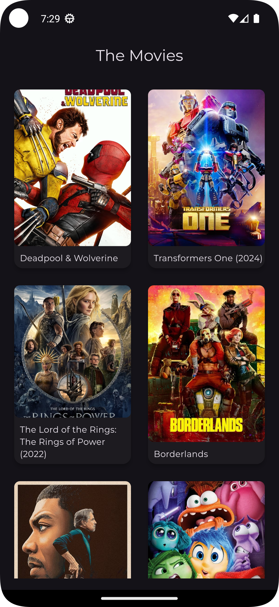
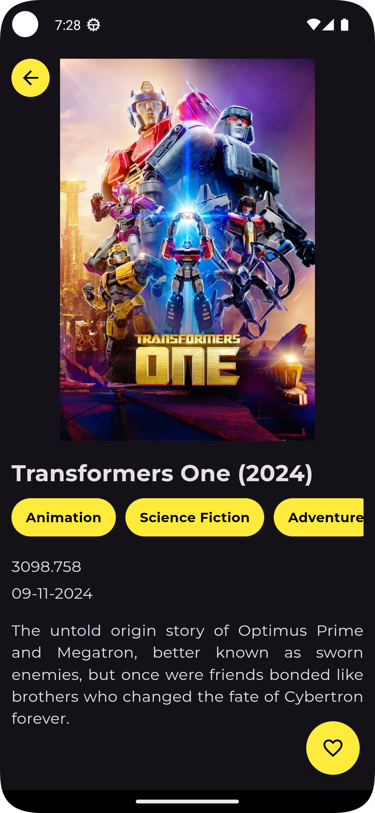

# Movies(Flutter)

Final Project Movies course Dicoding Indonesia Learn to Create Flutter Apps for Beginners(Belajar Membuat Aplikasi Flutter untuk Pemula) 

## Features

- Display a list of popular movies
- Movie details screen with full information
- Responsive UI for different screen sizes

## Screenshots




## Getting Started

### Prerequisites

- Flutter SDK: [Install Flutter](https://flutter.dev/docs/get-started/install)
- A device or emulator to run the application

### Installation

1. Clone the repository:
   ```bash
   git clone https://github.com/username/movies-app.git
2. Navigate to the project directory:
    ```bash
   cd movies
3. Install dependencies:
    ```bash
   flutter pub get
4. Run the app:
    ```bash
   flutter run


